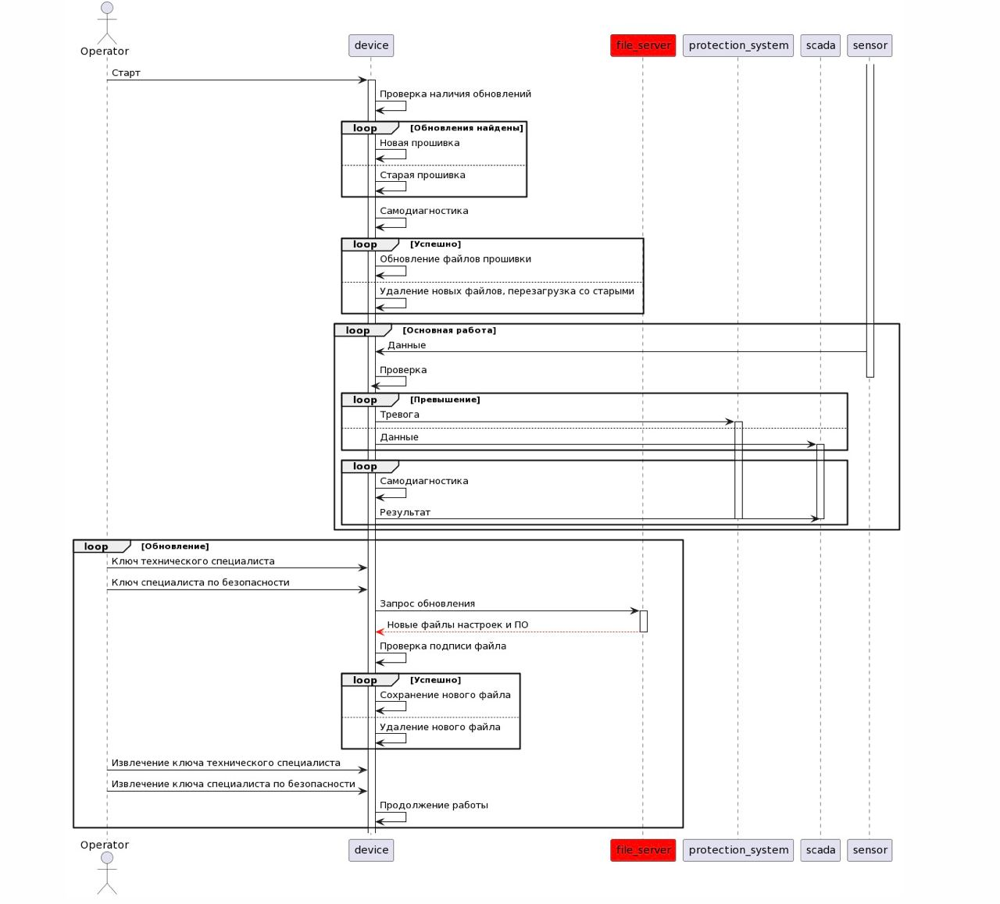
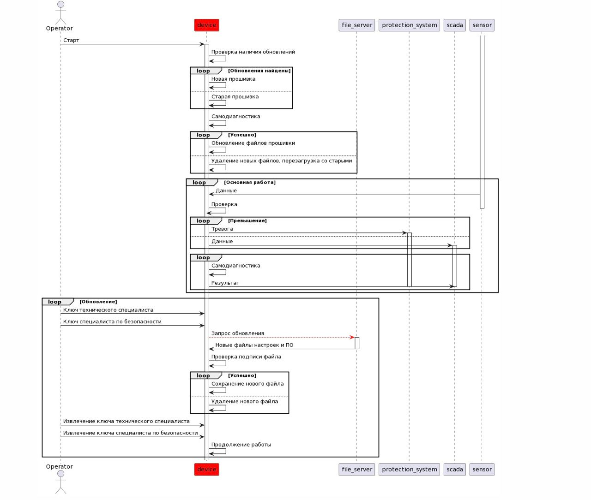
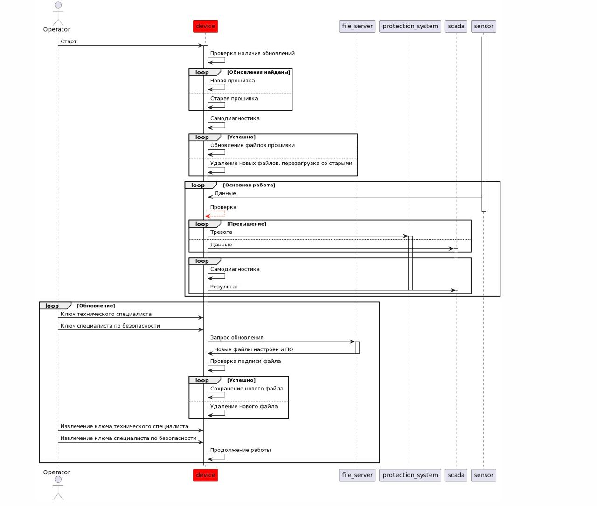

# Отчёт о выполнении задачи "Создание программы для обнаружения повышенного радиационного фона в трубах с паром на атомной электростанции"

- [Отчёт о выполнении задачи "Создание программы для обнаружения повышенного радиационного фона в трубах с паром на атомной электростанции"](#отчёт-о-выполнении-задачи-Создание программы для обнаружения повышенного радиационного фона в трубах с паром на атомной электростанции)
  - [Постановка задачи](#постановка-задачи)
  - [Известные ограничения и вводные условия](#известные-ограничения-и-вводные-условия)
    - [Цели и Предположения Безопасности (ЦПБ)](#цели-и-предположения-безопасности-цпб)
  - [Архитектура системы](#архитектура-системы)
    - [Компоненты](#компоненты)
    - [Алгоритм работы решения](#алгоритм-работы-решения)
    - [Описание Сценариев (последовательности выполнения операций), при которых ЦБ нарушаются](#описание-сценариев-последовательности-выполнения-операций-при-которых-цб-нарушаются)
    - [Указание "доверенных компонент" на архитектурной диаграмме.](#указание-доверенных-компонент-на-архитектурной-диаграмме)
    - [Политики безопасности](#политики-безопасности)
  - [Запуск приложения и тестов](#запуск-приложения-и-тестов)
    - [Запуск приложения](#запуск-приложения)
    - [Запуск тестов](#запуск-тестов)

## Постановка задачи

Необходимо разработать архитектуру системы, обеспечивающей защищенную передачу (сохраниение целостности и достоврености данных) данных с сенсора  на внешние системы (АСУ ТП и СУЗ).

Система может быть основана на недоверенных компонентах, поэтому в архитектуре необходимо учесть домены повышающие целостность данных.

## Известные ограничения и вводные условия


### Цели и Предположения Безопасности (ЦПБ)
Цели безопасности:
1. Только авторизованный оператор-технолог в присутствии оператора-безопасника может инициировать изменение настроек УД
2. Только авторизованный оператор-безопасник в присутствии оператора-технолога может обновлять ПО УД
3. УД выдаёт целостные и достоверные данные во внешние системы с задержкой не более 1 секунды в предположении, что операционная система удовлетворяет требованиям обработки данных в реальном времени


Предположения безопасности:
1. Не рассматриваются атаки, связанные с физическим доступом к оборудованию (например, подмена входных данных; подключение имитатора УД и т.п.)
2. Не рассматриваются риски, связанные с физическим отказом внешнего оборудования, включая обесточивание УД
3. Не рассматриваются риски, связанные с физическим отказом аппаратного обеспечения устройства

## Архитектура системы

### Компоненты
| Компоненты | Назначение| Комментарий|
| ------     | --------   |------------|
|update_checker| Проверяет целостность обновления путем подсчета контрольной суммы| Если условие не выполняется - обновление не устанавливается    |
|update_server| Устанавливает обновление и изменяет настройки при удовлетворении 1ой или 2ой цели безопасности | Если ключи не предоставлены - обновления не выполняется
|file_server |Эмулирует процесс установки обновления на УД                       | |
|decision_server |Проверяет входные данные на основе заложенных настроек                     |Проверяет певышение порога и выдаёт предупреждения|
|sensor|Получает данные о величине радиационного излучения|Данные с датчика отправляются УД |
|storage|Хранит логи событий, настройки УД и актуальную версию ПО| Запись настроек происходит при удовлетворении 1ой цели безопасности|
|protection system|Отправляет сообщение о превышении порогового значения оператору АСУ ТП либо автоматически подаёт команду в СУЗ реактора|Входные данные достоверны и целостны
|scada|Пульт управления станцией. Получает все данные и сообщения от УД|Входные данные достоверны и целостны
|message_bus|Шина передачи данных|
|security_monitor|Проверяет и ограничивает запросы между сущностями по установленным правилам| Управлет возможностью взаимодействия между доменами
|key_starter| Инициализирует проверку ключей|
|key_checker|Производит проверку наличия двух ключей прошедших авторизацию|

### Алгоритм работы решения

Данные с **сенсора** передаются **только через доверенные компоненты**. Для этого недоверенные компоненты разделятся на доверенные и повышающие доверие. **Данные с недоверенных компонент** сначала проходят через **домены повышающие доверие**.

> Этапы решения.

Выделение доверенных и недоверенных компонент исходя из ЦПБ.

Разбиение доверенных компонент на промещуточные сущности с целью уменьшения доверенной кодовой базы и повышением целостности входных данных.

Наложение ограничений на взаимодействия между доменами (security_monitor).

Подключение брокера (kafka) для обеспечения стабильности передачи данных.

Тестирование (статическое и автоматическое) кода. Создание ручных и автоматических сквозных и процедурных тестов.

Анализ изменений исходной архитектуры и размера доверенной базы.

Составление отчёта о проделанной работе.

### Описание Сценариев (последовательности выполнения операций), при которых ЦБ нарушаются

**Негативный сценарий №1. "Загрузка неаутентичных файлов обновления и настроек ПО":**


**Негативный сценарий №2. "Неавторизованный запрос обновления":**


**Негативный сценарий №3. "Неправильная проверка данных, поступивших от сенсора":**



| №| Название | Скомпрометированная часть системы| Нарушенная цель безопасности|
|---- | ------| -------- |------------|
|1|Ошибка проверки превышения порогового значения|device|3
|2|Запись скомпрометированной версии ПО на device|file_server|3
|3|Инициализация процесса обновления неавторзованными пользователями|update_server|1, 2

№1. Данные превышающие порог пришли в device, но были отмечены как не превышающие (не сработала проверка по пороговому значению - возможно было изменено пороговое значение или данные попали в if оператор, после чего были изменены)
Комментарий : т.к. используется сторонняя библиотека оба сценария возможны

№2. Т.к. в storage поступают данные из недоверенного file_server в device, сохранённые или сохраняемые данные могут быть скомпрометированы. Например на device будет записана скомпрометированная версия ПО.

№3. Инициализирован процесс обновления ПО неавторизованными пользователями.


### Указание "доверенных компонент" на архитектурной диаграмме.
Исходная архитектура системы.


Архитектура системы после внедрения киберимунного подхода. 


**Оценка сложности и размера кода (Условные обозначения)** 
- '-' - отсутствие кода
- **1** - простой
- **2** - средний
- **3** - сложный

- **S** - маленький
- **M** - средний
- **L** - большой


### Политики безопасности 


```python {lineNo:true}


def check_operation(id, details):
    authorized = False
    src = details['source']
    dst = details['deliver_to']
    operation = details['operation']
    if  src == 'sensor' and dst == 'decision_server' \
        and operation == 'signal_sent':
        authorized = True   
    if src == 'decision_server' and dst == 'scada' \
        and operation == 'info_sent':
        authorized = True   
    if src == 'decision_server' and dst == 'protection_system' \
        and operation == 'alarm':
        authorized = True   
    if src == 'update_server' and dst == 'decision_server' \
        and operation == 'software_update':
        authorized = True   
    if src == 'update_checker' and dst == 'update_server' \
        and operation == 'verified_update':
        authorized = True   
    if src == 'file_server' and dst == 'update_checker' \
        and operation == 'update_file'
        authorized = True   
    if src == 'update_checker' and dst == 'storage' \
        and operation == 'verified_setiings':
        authorized = True   
    if src == 'decision_server' and dst == 'storage' \
        and operation == 'logs_writing':
        authorized = True
    if src == 'storage' and dst == 'decision_server' \
        and operation == 'settings_downloading':
        authorized = True  
    if src == 'key_checker' and dst == 'update_server' \
        and operation == 'update_permission':
        authorized = True        
    if src == 'key_starter' and dst == 'key_checker' \
        and operation == 'update_request':
        authorized = True        
    return authorized


```

## Запуск приложения и тестов

### Запуск приложения

см. [инструкцию по запуску](README.md)

### Запуск тестов

_Предполагается, что в ходе подготовки рабочего места все системные пакеты были установлены._

Запуск примера: открыть окно терминала в Visual Studio code, в папке с исходным кодом выполнить 

**make run**
или **docker-compose up -d**

запуск тестов:
**make test**
или **pipenv run pytest**
